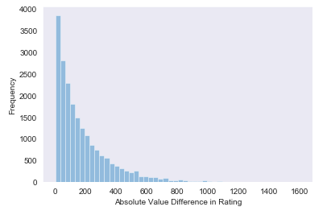
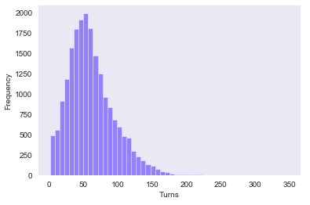
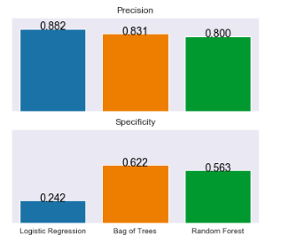
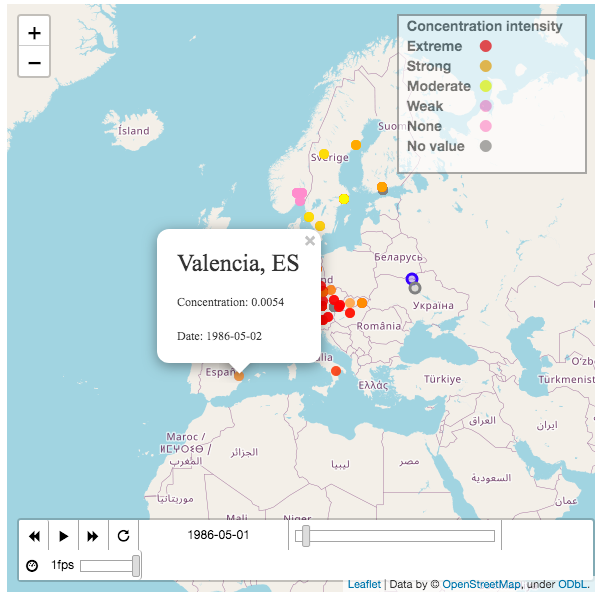

# Data Science Projects

This repository contains my personal data science projects.

## Table of contents
* [General info](#general-info)
* [Technologies](#technologies)
* [Projects](#projects)

## General Info

These projects arose from an interest in data science and seeing what I could produce
on my own. My projects contain work touching analytics, machine learning, and data
visualization.

## Technologies

I use Python version 3.6.1. Jupyter Notebooks (version 5.0.0) are also an essential part
to my workflow in being able to immediately to see quick data results and write for non-developer
audiences. For heavier coding and refactoring
purposes, I use pyCharm (community edition 2016.2.3). If you want to know the exact
packages I used in each project, check out the project descriptions.

## Projects

Ever wanted to predict the outcome of a chess match? In [my chess project](#Implementing), I use machine learning techniques
to predict who a winner in online matches will be.

Are you curious about the Chernobyl 1986 Incident or just wanted to see a beautiful data
visualization of map data? In [my Chernobyl visualization project](#Mapping), I map data from
the Chernobyl nuclear fallout and show its spread across time in continental Europe.

## Implementing statistical learning methods to predict chess match outcomes

You log in to your Lichess.org account and get ready to play an online chess match.
A random pairing places you with someone having a rating 200 points higher than you.
You get to play as white. What are your chances of winning?

This is a question this project seeks to answer. Kaggle.com provides a dataset with around 20,000
observations, and I extract interesting variables to help me answer this question. Two examples of these
variables are absolute difference in rating between players and number of turns. I perform an EDA
on the variables of interest. These are some sample graphs I produce in the EDA.

A logistic regression, a bag of trees, and a random forest crunch the variables I extract,
and then try their hand at predicting outcomes in the matches. I provide simple introductions
to the models used, metrics to judge the models by, and also interpret the results. Here's an extract
for Precision and Specificty measures in the models.

#### Instructions for accessing project

All relevant files are in the Chess folder in this repository. Navigate to this folder
and open the Version_one folder. Here you will find two files that show a report
of the project - chess_project.ipynb and chess_project.html. For those running a jupyter
notebook, the first file will do. If you're just going to view in the browser, open the chess_project.html.

#### Packages used

* pandas
* numpy
* seaborn
* matplotlib
* sklearn
* chess_utility - a module I created to simplify the analysis.

## Mapping dangerous nuclear fall out concentrations geographically

If you're an HBO fan, you may already be familiar with the nuclear accident that happened near
Chernobyl, Ukraine in 1986. This accident resulted in significant human casualties and spreading
nuclear fall out over most of continental Europe. What if we could map this nuclear fall out
in Europe in a meaningful way?

 This project aims to answer that question through an interactive map of the fall out
 in continental Europe. Kaggle.com provides the data set for three key nuclear fall out
 chemicals. Color coding intensities of nuclear fall out data, and being
 able to see these intensities change shows the evolution of nuclear fall out right
 after the Chernobyl accident.

#### Instructions for accessing project

All files related to this project are in the ChernobylAirData folder of this
repository. Navigate to the Version_one folder. Two files - chernobyl_project.ipynb
and chernobyl_project.html - contain a report of the project. For jupyter notebook users,
go with the first file. If you just want to open the project in a browser, use the second file.

#### Packages used

* pandas
* geopandas
* numpy
* math
* shapely
* seaborn
* matplotlib
* folium
* useful_functions - a module I created to simplify the analysis.

